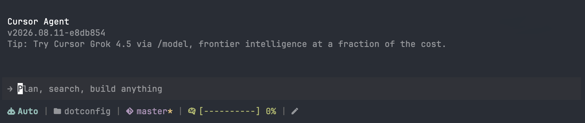

# Cursor (CLI) Agent Statusline

A minimal and functional statusline for
[Cursor (CLI) Agnet](https://cursor.com/cli)

## Installation + usage

### Using Go (requires Go installed)

```bash
go install github.com/5c077m4n/cursor-agent-statusline@latest
```

and then add to your `~/.config/cursor/cli-config.json`:

```json
{
  "statusLine": {
    "type": "command",
    "command": "~/.local/share/go/bin/cursor-agent-statusline"
  }
}
```

### Manual install (no Go required)

```bash
# Detect OS and architecture
ARCHIVE_OS=$(uname -s | tr '[:upper:]' '[:lower:]')
ARCHIVE_ARCH=$(uname -m)
case "$ARCHIVE_ARCH" in
  x86_64) ARCHIVE_ARCH="amd64" ;;
  aarch64) ARCHIVE_ARCH="arm64" ;;
esac

# Determine platform suffix (skip Windows)
if [ "$ARCHIVE_OS" = "darwin" ] || [ "$ARCHIVE_OS" = "linux" ]; then
  PLATFORM="${ARCHIVE_OS}_${ARCHIVE_ARCH}"
else
  echo "Unsupported OS: $ARCHIVE_OS"; exit 1
fi

# Resolve Cursor config directory (respect XDG_CONFIG_HOME)
CURSOR_CONFIG="${XDG_CONFIG_HOME:-$HOME/.config}/cursor"
mkdir -p "$CURSOR_CONFIG"

VERSION="0.0.3"
FILENAME="cursor-agent-statusline_${VERSION}_${PLATFORM}.tar.gz"
DOWNLOAD_URL="https://github.com/5c077m4n/cursor-agent-statusline/releases/download/v${VERSION}/${FILENAME}"

# Download, extract, place binary, and clean up
TMP_DIR=$(mktemp -d)
curl -sL "$DOWNLOAD_URL" -o "$TMP_DIR/$FILENAME"
tar -xzf "$TMP_DIR/$FILENAME" -C "$TMP_DIR"
mv "$TMP_DIR/cursor-agent-statusline" "$CURSOR_CONFIG/"
rm -rf "$TMP_DIR"
chmod u+x "$CURSOR_CONFIG/cursor-agent-statusline"
```

Then configure the statusline command in `$CURSOR_CONFIG/cli-config.json`:

```json
{
  "statusLine": {
    "type": "command",
    "command": "<value of $CURSOR_CONFIG - cursor does not expand env vars>/cursor-agent-statusline"
  }
}
```

> Replace `$CURSOR_CONFIG` above with the actual path (`~/.config/cursor` by
> default).

## Screenshot



## Benchmarks (using [hyperfine](https://github.com/sharkdp/hyperfine))

See the latest results in
[CI run](https://github.com/5c077m4n/cursor-agent-statusline/actions/workflows/ci.yaml?query=branch%3Amaster)
under the Benchmarks step summary.
